# Introduction

This demonstration explores cavity-modes and mode-locked lasers. The
simulation is of a mode-locked laser where the cavity length, the gain
medium, and the number of modes centered around the central mode
frequency are specified.

# Lasers, an overview:

Lasers are highly tunable devices capable of either delivering a very
narrow (near single) frequency of light or a broadband of frequencies
much like a comb. In general applications such as laser pointers, lasers
are most noted for their spatial coherence. That is, their ability to
maintain their near uniform intensity and shape across far distances.
Thomas Young’s double-slit experiment was first to conceive of this
notion of coherence where a wave propagating through space can be
described by the statistical similarity of the wave’s attributes between
two points in space. Coherence in lasers arises from the principle of
stimulated emission, which serves as the required amplification inside
lasers to create an intense beam of emitted photons. This concept of
stimulated emissions inside a laser device is what led to its own
namesake since LASER was initially just the acronym for “**L**ight
**A**mplification by **S**timulated **E**mission of **R**adiation”.

# Photon Absorption and Emission

Quantum mechanics describes several possible interactions between
photons and atoms; the simplest being the absorption of a photon in
transit near an atom. Typically, atoms exist in a ground state, which is
the lowest-energy state possible for an atom to exist in. However, an
electron contained within an orbital of an atom has the chance to absorb
the quanta of energy carried by a photon passing nearby. This causes the
electron to transition into a higher energy state and thus effectively
raises its atom to an energetic state above its own ground state. The
“lifetime” for an atom to exist in this excited state is finite and may
only last on the order of nanoseconds.

Max Planck determined the frequency of the photon, or the radiant energy
absorbed or emitted, was directly proportional to the frequency of the
radiation by the scalar constant, Planck’s constant. Consequently,
Planck’s relation states the photon energy is:

$$E = \\frac{\\text{hf}}{1.6 \\times 10^{- 19}\\ \\lbrack\\ J\\rbrack}\\ \\lbrack eV\\rbrack$$

Furthermore, Bohr established a frequency condition which stated the
energy absorbed or emitted by an atom during an electron transition is
equal to the frequency of the photon. Consequently, energy of a system
after photon interaction will change by units of hf (electron-volts)
before or after an electronic transition. This means the change in
energy *Δ**E* in a system is equal to the photon energy absorbed or
emitted.

When the electron reoccupies its original orbital energy state after
occupying a higher energy level, the atom falls back to its ground state
but not before also emitting a photon. This photon carries the quanta of
energy lost by the atom and originally carried by the first photon, as
per Bohr’s frequency condition. This form of photon generation is
referred to as spontaneous emission and occurs naturally.

We don’t normally perceive spontaneous emissions because it’s rare to
find an atom above its ground level. When one does, though, the
frequency of occurrence is random enough that we cannot entirely
perceive any quantized amount of photon emission above our eye’s
perceivable threshold. Photons are spontaneously emitting all around us
though.

> An important caveat to note is some materials have a greater
> proclivity for spontaneous photon emission. Some radioactive isotopes,
> for instance, have an exponential decay of harmful photons referred to
> as ionizing gamma radiative emission. Radioactive emission can be
> classified as being alpha, that is, helium nuclei emission; beta,
> which is electron or positron emission; and gamma radiation, which is
> characterized as photon emission. Gamma photon emission is the most
> dangerous due to its devastation on organic living matter and requires
> significant shielding of either lead or concrete.

While the lifetime of an atom occupying an energetic state above its
ground state is short, there are instances where an atom lives just long
enough to interact with a transit photon. Albert Einstein first surmised
an atom could spontaneously generate a photon after interacting with
another photon. In this scenario, the transit photon causes the atom to
spontaneously drop back down to a lower energy level and generate a
second new photon carrying the released quanta of energy. This process
is identical to photon absorption insofar as the *energy* involved in
the level transition in either event is identical. However, the
transition change in atomic energy levels for a stimulated emission is
*opposite* direction to an absorption event wherein energy of the atom
is lost to the emitted photon rather than gained.

The diagram below summarizes the various forms of photon interaction so
far discussed:

<table>
<colgroup>
<col style="width: 100%" />
</colgroup>
<thead>
<tr class="header">
<th>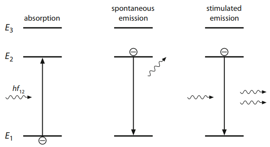</th>
</tr>
</thead>
<tbody>
<tr class="odd">
<td>
Three forms of photon interaction are illustrated for an atom described with a 3-level electron energy diagram.

<table>
<colgroup>
<col style="width: 27%" />
<col style="width: 72%" />
</colgroup>
<thead>
<tr class="header">
<th><strong>(A) Absorption</strong></th>
<th>occurs when a photon carrying quanta of energy is absorbed by an atom causing an atom’s electron to transition to a higher energy level for a short period of time.</th>
</tr>
</thead>
<tbody>
<tr class="odd">
<td><strong>(B) Spontaneous Emission</strong></td>
<td>occurs when the electron can no longer hold its higher energy state and releases the original quanta of energy in the form of a photon causing the atom to drop back down to a lower energy level.</td>
</tr>
<tr class="even">
<td><strong>(C) Stimulated Emission</strong></td>
<td>occurs when an atom can exist in a higher energy state long enough to interact with a photon causing a second photon to be generated.</td>
</tr>
</tbody>
</table></td>
</tr>
</tbody>
</table>

# Population Inversion and the Journey to Excess Photon Generation

Lasers exploit the principle of stimulated emission to encourage photon
generation because the original transit photon isn’t lost in the
process. This promotes a population increase of photons because for
every 1 photon that interacts with a highly energized atom, 2 photons
emerge. However, recall the lifetime of atoms occupying a highly excited
discrete energy state is very short and on the order of nanoseconds.
This is generally not long enough for stimulated absorption to occur
everywhere since this process is usually observed on the order of
microseconds or even milliseconds. So, while an individual excited atom
has the potential for single-handedly doubling the number of photons in
some instance of the system, the system, as a whole, may just reabsorb
those photons since atoms up the road have already fallen back to their
ground state. Consequently, spontaneous emission or decay with no photon
generation dominate the system and no new photon production occurs. To
exponentially generate new photons within a system, clearly then more
atoms need to occupy an energized state than their ground state. To do
so, a process referred to as **Population Inversion** is employed.

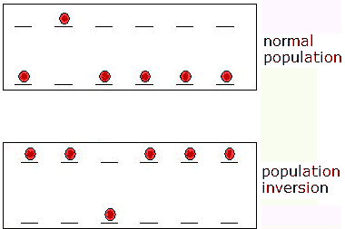

> Unlike in normal population distributions that occur naturally where
more atoms occupy an unexcited ground state, a population inversion
forces a dominant number of atoms to occupy a higher excited state.
Typically, an external pump source energizes the atoms out of their
ground state.

Population inversion is a state in which a greater number of atoms
occupy an excited state than in a lower unexcited ground state. This
distribution is typically not found in nature and hence the need to
invert the natural distribution of energized atoms is required. However,
a system which has undergone a population inversion will over time
redistribute its system of atoms into roughly equal populations of
energized and ground state atoms. This ultimately doesn’t help with new
photon generation, no new photons are produced, and the photons that
originally entered the system become the same number of photons which
emerge from the system. Consequently, the concept of perpetually
“pumping” atoms back into an excited state is required. Referred to as
**Source Pumping,** laser systems require an external source of energy
to maintain population inversion.

> Examples of common pump sources are electrical discharges, flashlamps,
> arc lamps, light from another laser, chemical reactions, and even
> explosive devices. The type of pump source used principally depends on
> the gain medium of the system, and this also determines how the energy
> is transmitted to the medium.

Unfortunately, population inversion alone is not enough to keep up
photon production within a system. While source pumping can reduce the
time an atom spends occupying an unexcited ground state, pumping does
not increase the lifetime of the atom occupying an *excited* state. This
means the same limited short lifetime affects the overall photon
generation. To work around this issue, the concept of metastable states
within the energy band of an atom must be made available to allow for
longer lifetimes. While the lifetime within a highly excited state may
elapse within nanoseconds, an atom occupying a metastable state may have
a lifetime on the order of milliseconds, which is just enough time for
stimulated emission to occur.

Most atoms and molecules have a metastable state, and it can be
perceived as a form of temporary energy trap for an atom to occupy
before falling back down to an unexcited ground state. For example, an
external pump source excites an atom into a short-lived but highly
energized state until spontaneously dropping to a pseudo lower-energy
state with an extraordinary longer lifetime. Quantum Mechanics ensures
this process is more likely to occur with an external pump source since
it is easier to excite an atom into a short-lived highly energized
states rather than directly into a metastable state. This is dictated by
a **selection rule** which constrains the possible transitions of a
system into discrete steps. However, the presence of metastable
transition levels is derived specifically from the probability for an
electron to occupy a transition level overlapping with the probability
to occupy the orbital ground state of an atom.

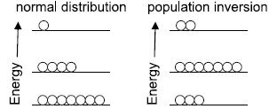

> **Normal distribution** of atoms predicts that most atoms occupy their ground state. With **population inversion**, typically an external source of energy bumps atoms out of their ground state and into a metastable state that has a much slower lifetime.

| **Relative population of occupying atoms** | **Dominant state**                                                                                                                                                                                                                                                                                                                                             |
|--------------------------------------------|----------------------------------------------------------------------------------------------------------------------------------------------------------------------------------------------------------------------------------------------------------------------------------------------------------------------------------------------------------------|
| *N*1 \> *N*2          | Most atoms occupy the ground state and thus most transit photons are likely absorbed and spat back out nanoseconds later just to probably have the same process occur again up the road.                                                                                                                                                                      |
| *N*1 = *N*2           | When population of atoms occupying a ground state becomes equal to the population of atoms occupying an energized state, the photon production falls to zero. No new photons are produced and the photons you start with are the same number of photons that emerge out of the system.                                                                        |
| *N*1 \< *N*2          | **Population Inversion**. Most atoms occupy an energized state to promote photon generation. While absorption still occurs along a transit photon’s path through the atomic minefield, the generation of new photons greatly dominates the system. Without active pumping, population inversion tends to collapse back into *N*1 = *N*2.|

# Three- and Four-level Energy bands

The first laser constructed by Theodore Maiman in 1960 was a three-level
laser medium constructed of ruby (Cr3+:Al2O3). In this system
configuration, atoms are pumped into a high-energy state, quickly fall
into a metastable state, and when stimulated by a near passing photon,
generate a photon and drop back down to their ground state. This system
is no longer common since an inefficient amount of energy is required to
pump atoms out of their ground state. For this reason, four-level and
quasi three-level systems are more commonplace. In either system, atoms
are no longer pumped out of their ground state after emitting a photon
but rather a metastable state above ground. Consequently, four-level
systems ensure no appreciable population accumulation of atoms within
the ground state, which further prevents significant reabsorption of
laser photon radiation. A popular example of a four-level laser is the
Nd:YAG crystal. What causes a metastable state? I thought metastable had
to be above the highest energy level, so how do they exist slightly
above the ground state? What would cause atoms to normally skip through
that metastable state and go on up to the other energy levels instead?

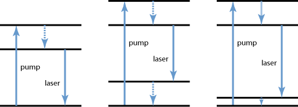

|           |                                                                                                                                                                                                           |
|-----------|-----------------------------------------------------------------------------------------------------------------------------------------------------------------------------------------------------------|
| **(1)**   | **three-level system** where atoms drop back down to their ground state after emission.                                                                                                                   |
| **(2)**   | **four-level system** where atoms drop down to an energy level still above the ground state. This construction is most efficient since pumping atoms back to a highly energized state requires less work. |
| **(3)**   | **quasi three-level system** where atoms fall into an intermediate metastable state just above ground state.                                                                                              |

# Laser Gain Mediums

|                    |                                                                                                                                                                                                                                                                                  |
|--------------------|----------------------------------------------------------------------------------------------------------------------------------------------------------------------------------------------------------------------------------------------------------------------------------|
| **Crystals**       | Typically doped with rare earth metals: (neodymium, ytterbium, or erbium) or transition metal ions (titanium or chromium); most often yttrium aluminum garnet (Y3Al5O12), yttrium orthovanadate (YVO4), or sapphire (Al2O3);\[1\] and not often Cesium cadmium bromide (CsCdBr3) |
| **Glasses**        | silicate or phosphate glasses, doped with laser-active ions                                                                                                                                                                                                                      |
| **Gases**          | mixtures of helium and neon (HeNe), nitrogen, argon, carbon monoxide, carbon dioxide, or metal vapors                                                                                                                                                                            |
| **Semiconductors** | gallium arsenide (GaAs), indium gallium arsenide (InGaAs), or gallium nitride (GaN)                                                                                                                                                                                              |
| **Liquids**        | dye solutions as used in dye lasers.                                                                                                                                                                                                                                             |

# Optical Cavity Resonators

While a laser gain medium has the proclivity to emit photons when
stimulated, a greater density in photon generation can be encouraged by
placing the gain medium inside a **cavity resonator**. Photons emitted
from the gain medium reflect off mirrors on either end of the cavity,
which allows photons to travel roundtrip multiple times inside the
cavity and through the gain medium. This process has an exponential
effect on photon generation since photons emitted from the crystal are
reinjected into the crystal causing even more photons to be created.
This a form of closed-loop positive feedback where cascading reactions
inside the crystal are reintroduced repeatedly and thus increasing the
photon density significantly.

The roundtrip motion a photon travels inside the cavity is directly
proportional to the energy it caries in the form of an optical
wavelength. Consequently, the light confined to the inner cavity and
reflected over multiple iterations through back-and-forth travel creates
**standing waves**. A standing wave inside a cavity is much like a piece
of string attached between either end of the cavity mirrors. When
plucked, the string begins to move up and down in oscillating motion.
However, the ends of the string are still fixed to the mirrors. That is,
the endpoints of the string always begin and end at the same point. This
is a standing wave since only the peak amplitude of the wave appears to
seemingly change within a fixed position as if constrained between the
mirrors themselves. When plucked, this is the natural frequency, or the
first **mode**, of the system and since energy of a photon is its
propagation frequency, only photons of a specific energy are permitted
to travel within the laser cavity.

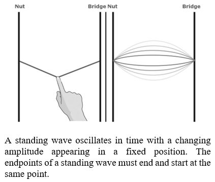

Not all photons emitted by the gain medium form a standing wave inside
the laser cavity. The longest wavelength (lowest frequency) permitted
is, in fact, determined by the length of the cavity. This is indicated
by the primary wavelength, *λ*1, or first mode of the cavity
being expressed as:

|                        
 *λ*1 = 2*L*  | or  |                            
                                $$f\_{1} = \\frac{2L}{c}$$  |
|------------------------|-----|----------------------------|

**Note**: losses due to diffraction and absorption within the cavity are
omitted from the expression. However, losses typically modify the
effective length of the cavity in the form of a percent of photon
transmission within the system. The expression is simply modified to:
*λ* = 2*n**L*.

To eject photons from the laser cavity, one of the cavity mirrors is
only coated with partial reflectivity. This means as photons complete
roundtrips through the cavity, some photons escape the cavity through
the partially reflective mirror. The escaped photons pass through an
aperture which helps narrow the beam, then through several focusing
lenses, and finally through a collimating lens. The collimator is what
ensures the characteristic appearance of laser output by not only
narrowing the beam width but aligning the photons along parallel lines.
How do collimator’s work? Do they polarize? Employ electromagnetic
properties? Or is it that they are designed to only allowed the photons
oriented a certain direction to escape?

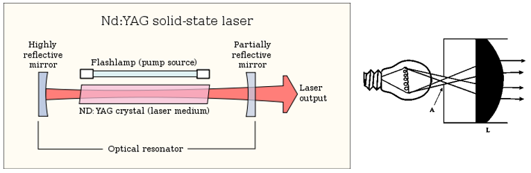

Illustration of a Nd:YAG solid-state laser being pumped by a flashlamp to stimulate the emission of photons within a confocal laser cavity resonator. In most applications, the output laser light is narrowed, and the direction of photons arranged parallel to one another using a collimated lens.                                                                                               |

The Fabry–Pérot is the most basic example of a cavity resonator
constructed of two flat (plane-parallel) mirrors. This cavity is also
the most unreliable in practice since the mirrors need to be precisely
aligned. Otherwise, light easily escapes the cavity. Consequently,
plane-parallel constructions are typically relegated to only very short
laser cavities where mirror alignment is much easier to perform.
However, in these situations, a special reflective film is typically
coated on either end of the crystal gain medium rather than using
physical mirrors.

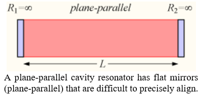

> The precision of the Fabry–Pérot cavity makes it suitable for
> applications where alignment is critical. For example, the LIGO
> (**L**aser **I**nterferometer **G**ravitational-Wave **O**bservatory)
> used to confirm the existence of gravitational waves back in 2015
> employed the Fabry-Perot cavity in conjunction with the Michelson
> interferometer to extend the effective arm length to 4km due to cavity
> reflection.

On the other hand, confocal cavities are more common because the chance
for light to escape the cavity is less likely due to the curvature of
the mirrors refocusing the light back to the center of the cavity.
Hence, the beam waist is often narrowest at the center and normally
where the gain medium is placed. These cavities are typically used in
applications where more uniformly distributed beam irradiance is focused
at the beam center since narrower beams produce less angular deviation.

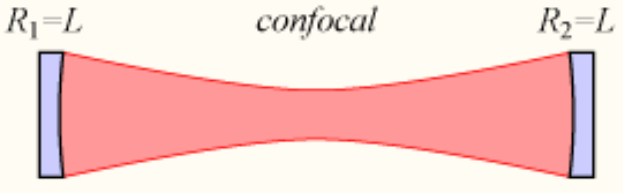

# Longitudinal Modes

Modes besides just the fundamental wavelength, *λ*1, can
exist within a cavity. Revisiting the vibrating string example from
earlier, plucking the string generates the fundamental mode of the
system. However, by manually shaking the string up and down, other
standing waves can be produced inside the cavity. The only rule being
that the oscillation must start and end at the same point – otherwise
discontinuities in the oscillation cycle occur. Consequently, with such
a flexible rule, the number of standing waves permitted inside a cavity
is infinite. In reality, though, the number of modes within a cavity
permitted is dependent on not only the length of the cavity but the
laser gain medium emitting the photons as well.

The standing wave equation for the fundamental mode of a laser cavity
with an undetermined phase *φ* is represented as:

$$y(t) = \\sin{\\left( 2\\pi f\_{1}t \\pm \\varphi \\right) = \\boxed{\\sin\\left( 2\\pi\\frac{c}{\\lambda\_{1}}t\\  \\pm \\ \\varphi \\right)}\\ }$$

The frequency, *f*, is the rate at which a photon propagates through a
medium and should not be confused with the velocity at which the photon
travels through a medium. If the fundamental mode of the laser cavity is
directly proportional to the length of the cavity, then the rate at
which the photon propagates through that cavity must thereby be
proportional to the length as well. Consequently, the frequency at which
a standing wave within the laser cavity is expressed as:

$$f\_{1} = \\frac{c}{\\lambda\_{1}} = \\boxed{\\frac{c}{2L}}$$

In the above expression, both length and velocity, c, of the frequency
must remain fixed. Then, to obey the rule that a standing wave must
start and end at the same point between two cavity mirrors, higher
frequency modes permitted must be an integer multiple, q, of the
fundamental frequency of the cavity. Thus, discrete modes, q, of the
radiated frequencies of photons occupying the cavity is expressed as:

$$f\_{q} = \\boxed{q \\cdot \\frac{c}{2L}}$$

Non-integer values of q are not permitted since the resultant wave
within the cavity would have discontinuous endpoints that do not match
up. Subsequently, the cavity modes are truly discretely spaced since the
frequency separation, or difference, of two neighboring modes resolves
the fundamental frequency of the laser cavity. In other words:

$$\\boxed{\\Delta f = f\_{q} - f\_{q - 1} = \\frac{c}{2L}}$$

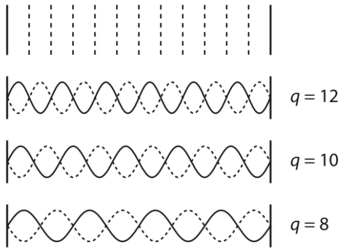

The number of possible longitudinal modes of a cavity is determined by
the gain bandwidth of the active gain medium. By the very nature of
laser mediums, there is usually one dominant photon energy emission, or
frequency observed. However due to imperfections and minute differences
from one atom to the next, varying energies close to the dominant
frequency are also emitted. The distribution of these other emitted
frequencies falls approximately along a gaussian distribution where most
of the photon population are emitted at a specific frequency at the top
of the bell curve.

Not all longitudinal modes within the gain bandwidth of the laser medium
get emitted from the cavity. The gain curve represents population of
photons measured as output power. Thus, a computed laser threshold
indicates mode populations below this line are lost to diffraction
within the cavity. For gaussian distributions, the laser threshold is
typically expressed as the full width, half max (FWHM) of the gain
curve. That is, the width of the curve at half the maximum value.

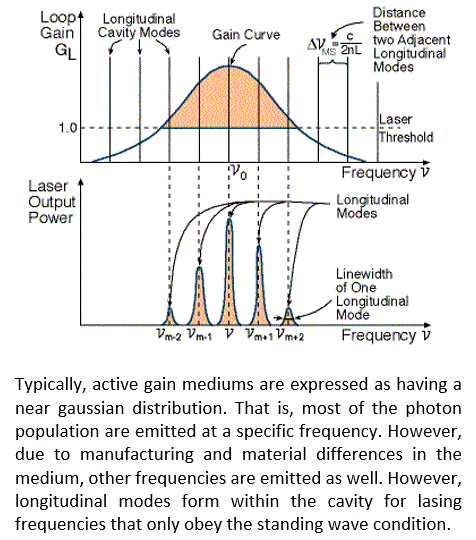

# Mode Locking

The gain curve and cavity length determine the number of longitudinal
modes emitted. However, these standing waves are seldom in phase with
one another. By inducing a fixed-phase relationship of the longitudinal
modes, referred to as **Mode Locking**, short pulses can be emitted. A
femtosecond laser used in refractive surgeries is a popular example of a
mode-locked laser.

> Refractive eye surgeries such as LASIK (**L**aser-**A**ssisted in
> **Si**tu **K**eratomileusis) peal back the thin cornea-flap of the
> epithelium created by a femtosecond laser pulse. Since the pulse is so
> brief, the laser can only travel a short distance from the surface of
> the eye before forming microcavitation pockets. The microcavitation
> caused by separation of corneal tissue is then folded back to allow
> reshaping of the corneal tissue using an excimer lens.

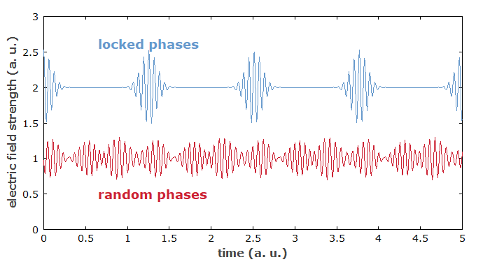

# Transverse Modes

The transverse electromagnetic mode (TEM) structure of a laser beam
describes the distribution of intensity (power) across the beam
cross-section. Typically, a laser output is the combination of several
transverse modes. Consequently, seldom are the discrete modes typically
seen without additional filtering techniques. In nearly all
circumstances, though, the fundamental mode is nearly always generated
since it requires high gain and low losses close to the axis of
propagation. This suggests narrower laser cavities reduce the number of
transverse modes since the degree of angular deviation from the center
of the cavity is reduced. This means lower order modes are more
reproduceable with a reasonably stable laser, while higher order modes
require greater care. Why is the output of longitudinal such a nicely
behaved wavefront, but for transverse it seems… a bit of a mess, from
this photo?

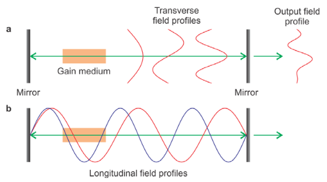

Basic experiments can demonstrate the various lower order transverse
modes. For instance, mounting one of the cavity mirrors onto a precision
kinematic mirror mount and adjusting yaw or pitch of the mirror can
reveal transverse modes by adjusting the distribution of irradiance of
the beam. To selectively identify specific transverse modes, a thin wire
of approximately 25 microns wide can be placed in front of a beam. This
will cause TEM00 to be filtered out of the beam due to losses from
reflection off the wire, while freely passing TEM10 or TEM01 depending
on the orientation of the wire. Another experiment is to place a
narrowing aperture in line with the beam. Narrowing the aperture removes
higher order transverse modes from the beam while passing only the
fundamental transverse mode, TEM00.

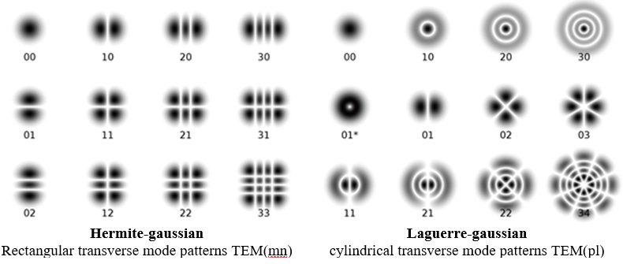

# Sources:

<https://micro.magnet.fsu.edu/primer/java/lasers/electroncycle/index.html>

<https://en.wikipedia.org/wiki/Stimulated_emission>

<https://en.wikipedia.org/wiki/Theodore_Maiman>

<https://flex.phys.tohoku.ac.jp/~rsaito/saito20-GaussianBeam.pdf>

<https://laser.physics.sunysb.edu/_alex/tmodes/webreport.html>

<https://www.slideshare.net/dlorenser/part-i-laser-basics-lorenser-2009>

<https://www.rp-photonics.com/stimulated_emission.html>

<https://spie.org/samples/TT53.pdf>

<https://www.edmundoptics.com.sg/knowledge-center/application-notes/lasers/laser-resonator-modes/>

<https://www.newport.com/n/critical-laser-components>

<http://labman.phys.utk.edu/phys222core/modules/m11/lasers.html>

<https://physics.stackexchange.com/questions/75247/decay-of-metastable-state-spontaneous-vs-stimulated-emission>

<https://www.photonlexicon.com/laserfaq/laserstr.htm>
